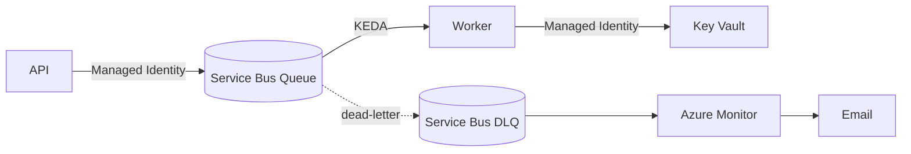

# Divine Tech Home Assignment

## Table of Contents

- [Divine Tech Home Assignment](#divine-tech-home-assignment)
  - [Table of Contents](#table-of-contents)
  - [Description](#description)
  - [Architecture Diagram](#architecture-diagram)
  - [Configuration Files](#configuration-files)
  - [Python Code](#python-code)
  - [Pipeline](#pipeline)
  - [Terraform](#terraform)
    - [terraform code will build](#terraform-code-will-build)
    - [terraform code to run](#terraform-code-to-run)
  - [Build Docker Image](#build-docker-image)
  - [Testing API](#testing-api)
  - [One Paragraph: "What I would change in a real production environment"](#one-paragraph-what-i-would-change-in-a-real-production-environment)

## Description

A GitHub repository containing the code, IaC, and pipeline
this how to deploy, how to tear down, and a simple architecture diagram
using an Azure Free Account, There is no need to keep the environment running after submission.

## Architecture Diagram

API ──> Managed Identity ──> Service Bus Queue ──> KEDA
Worker ──> Managed Identity ──> Key Vault
Service Bus DLQ ──> Azure Monitor ──> Email



## Configuration Files

the project include general files to complete tasks before pushing to git

- `.pre-commit-config.yaml` to run automated task before uploading new code to git
- `.typos.toml` to check for typos in the text
- `.gitleaks.toml` to check for password or secrets leaks
- `.yamllint.yaml` to check code lint

and other files for different issues

## Python Code

the application code is located in the `src` folder

- APP
  - API
  - Worker

## Pipeline

in Github Actions, run `reusable_docker_build_image.yaml` pipeline
setup the git project in github actions with variable inputs for the pipeline

- ACR_NAME
- IMAGE_NAME
- RESOURCE_GROUP
- CONTAINER_APP_NAME

## Terraform

### terraform code will build

- Azure Container Registry
- Azure Container Apps (for the API and the Worker)
- Azure Service Bus Queue
- Azure Key Vault
- Log Analytics Workspace

### terraform code to run

login to your azure account

```bash
az login
```

the terraform code is using `secret.tfvars` to pass variables
Note: the code include `-auto-approve` this will build the infrastructure without asking for approve

```bash
cd terraform

terraform init

terraform plan -var-file="secret.tfvars" -out=plan-out.tfstate

terraform apply -var-file="secret.tfvars" -backup=plan-out.tfstate -auto-approve

terraform destroy -auto-approve

```

## Build Docker Image

- build docker image

```bash
docker build . -t divine-ai:000
```

- login to azure account

```bash
az acr login --name registry_name
```

- push docker image to azure acr

```bash
docker push registry_name.azurecr.io/divine-ai:000
docker push registry_name.azurecr.io/divine-ai:latest
```

- run docker container

```bash
docker run -p 8000:8000 --name divine-app divine-ai:000
docker run -p 8000:8000 --name divine-app divine-ai:latest
```

## Testing API

```bash
curl -X POST localhost:8000/webhook/message -H 'Content-Type: application/json' -d '{"user":"alice","text":"hi"}'

curl localhost:8000/health
```

---
---

## One Paragraph: "What I would change in a real production environment"

- in a `production environment` you should think about security and never hard-code password or secrets
  secure the connection between the resource and endpoints
  separate the api and worker
  change the infrastructure to kubernetes for better automation (ArgoCD) and resource management
  add more logs levels for the application for debugging
